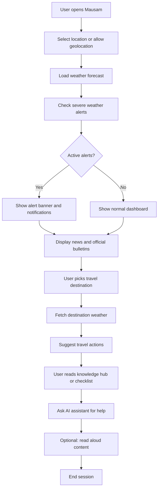

# Mausam

A weather and disaster-preparedness dashboard for travellers, residents, and emergency responders. View live forecasts, severe-weather alerts, news, travel advisories, safety checklists, and a knowledge hub in one place.

## Tech Stack

- **Framework:** [TanStack Start](https://tanstack.com/start) with React 19
- **Styling:** Tailwind CSS v4
- **Backend & Auth:** Lovable Cloud / Supabase
- **Language:** TypeScript
- **Runtime:** Bun

## Getting Started

1. Install dependencies:

   ```bash
   bun install
   ```

2. Start the development server:

   ```bash
   bun dev
   ```

3. Open `http://localhost:8080` in your browser.

## Scripts

| Script          | Description               |
| --------------- | ------------------------- |
| `bun dev`       | Start the Vite dev server |
| `bun run build` | Build for production      |
| `bun test`      | Run the Vitest test suite |
| `bun lint`      | Run ESLint                |

## Project Structure

```text
src/
  components/      # Reusable UI components and dashboard widgets
  hooks/           # Custom React hooks
  integrations/    # Supabase client, auth middleware, types
  lib/             # Utilities, queries, server functions, validators
  routes/          # TanStack Start file-based routes
  styles.css       # Tailwind v4 theme and global styles
public/            # Static assets
supabase/          # Migrations and config
tests/             # Unit and integration tests
```

## Features

- Hyper-local weather forecasts and severe-weather alerts
- Breaking news and official bulletins by location
- Travel advisory with destination weather and action suggestions
- Safety checklists and emergency contacts
- AI assistant for weather and disaster-related questions
- Read-aloud support for news, alerts, weather summaries, and knowledge topics
- Multi-language support (Hindi, Spanish, Arabic, Marathi, Mandarin)

## How the App Works



## Environment Variables

The project expects standard Lovable Cloud / Supabase environment variables. These are managed automatically in the Lovable environment; do not commit secrets to Git.

## License

Copyright © 2026 Mausam. All rights reserved.
